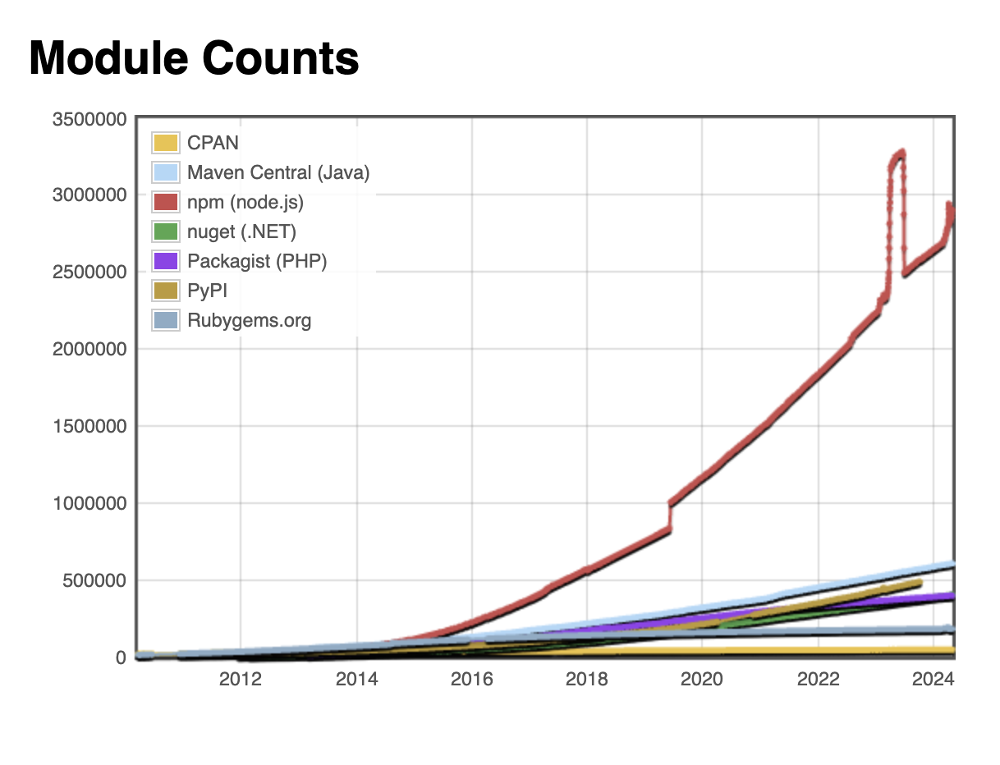
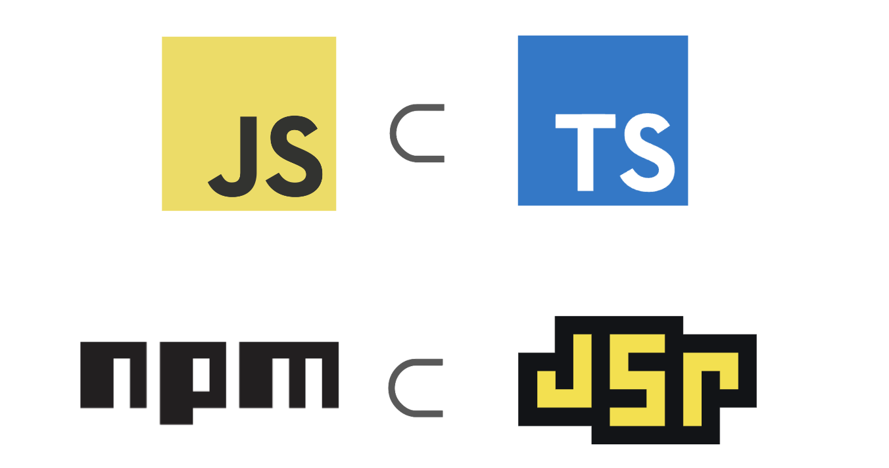

class: middle, center

#  の話

Yoshiya Hinosawa @kt3k

---
class: text-4xl

# 目次

- JSR の狙い
- JSR の特徴
- Deno と JSR

---

## Yoshiya Hinosawa


- x.com / github - @kt3k
- Deno の中の人。最近は Deno Standard Library と Deno 本体の Node 互換周り担当
- 昔サウス 36F - 38Fで働いていました (- 2019)

---
## npm レジストリのすごいところ

- 最大のソフトウェアパッケージレジストリ
- 300万パッケージが存在



---

## npm レジストリのよく無いところ

- ES6 や TS が無い頃にデザインされたままあまり変わっていない
- CommonJS がデフォルト
  - CJS と ESM をサポートするための仕組みはあるが複雑 (Conditional exports)
- TypeScript に関するサポートが無い
  - 自前で d.ts をビルド or DefinitelyTyped を手動でメンテナンスする -> 辛い

---
## npm レジストリの開発は低調(?)

- 新機能があまり追加されていない
- Open Source では無いので、コミュニティー主体で開発を進めることも出来ない

--
- npm は2020年に github に買収された
- 買収直前に主要メンバーが npm を去った (開発停滞の一因かも?)

---

## JSR チームが考えたこと

--

=> レジストリに関する革新がここ数年止まってしまっているのではないか?

--

=> TS はメインストリームと言われているのに「TS で普通にライブラリを書くこと」が難しいのはおかしいのでは?

--

=> ESM と TS を前提としたレジストリを0から設計したら良いのではないか?

---
class: middle center

# Introducing


--

JSR = JavaScript Registry

---

# JSR の特徴

- TypeScript を直接パブリッシュ出来る
- モジュール解決は ESM だけ (CommonJS は無し)
- npm と互換性あり
- 複数ランタイムを意識した作り
- レジストリ全体がオープンソース
- provenance 機能によるセキュリティの強化

---

## npm 互換性

- JSR パッケージから npm パッケージを使える
  ```
  import chalk from "npm:chalk";
  ```
- npm パッケージから JSR パッケージを使える
  ```
  import { Hono } from "@hono/hono";
  // JSR 版の Hono に依存できる
  ```


---

## npm 互換性

- JSR は npm とは別の何かではなく、npm の資産を活用しつつ拡張するもの (スーパーセット)

<p class="text-center">
  
</p>

---

## npm 互換性 (仕組み)

- Node から JSR パッケージを使う場合
  ```
  npx jsr add @hono/hono
  ```
- 上記コマンドを実行すると以下の内容の `.npmrc` ファイルが手元で作成される
  ```
  @jsr:registry=https://npm.jsr.io
  ```

---
## npm 互換性 (仕組み)

```
@jsr:registry=https://npm.jsr.io
```
本来は特定の '@scope' をプライベートな npm レジストリに向けるための機能をうまく利用し 'JSR' レジストリから 'npm' パッケージをダウンロードさせている
```
"dependencies": {
  "@hono/hono": "npm:@jsr/hono__hono@^4.6.3"
}
```
`package.json` には上のように追加される


---
class: inverse center middle

JSR 上の Hono を<br />npm package として使うデモ

---

# TypeScript サポート

- TypeScript を直接パブリッシュできる
- トランスパイルが不要
- d.ts は JSR が自動生成
- TypeScript の jsdoc コメントからドキュメントページ(APIリファレンス)を自動生成

--

<p class="text-center">
「ソースコードを書いて publish するだけ」
</p>

---

## 複数ランタイム対応

- サポートしてるランタイムを JSR 上で設定できる

<p class="text-center">

</p>

---
## 改善されたDX(ライブラリ提供者目線)

- TS をビルドしなくて良い
- ドキュメントはソースコードに書くだけで良い
- Publish ミスの自動検出
  - ES Module / 型定義のチェックが自動で行われる

---
## 改善されたDX(ライブラリ利用者目線)

- 型が壊れている事が無い
- 何が export されているか必ず分かる
- ドキュメントがある可能性が高い
- どのランタイムがサポートされているか分かる

---
## JSR はオープンソース

- https://github.com/jsr-io/jsr で開発されている
- レジストリの全体が公開
- セルフホストも可能
  - Postgres, S3互換ストレージ, Linux サーバ上で稼働
- 機能要望・提案・Pull Request なども可能

---
## 注意点

- JSR は ESM しかサポートしない
- CJS を使っているユーザーはサポートできない

--
- CJS からの利用が絶対必要な人は「まだ」使わないほうが良いかもしれません

--
- ただし Node.js v22 で require(ESM) ができるようになる [node#55085](https://github.com/nodejs/node/pull/55085)

---
class: center middle inverse

JSR にパブリッシュするデモ

---
## Deno と JSR の関係

- JSR の開発者は今のところ Deno の開発者が多い
- Deno のためのより良いレジストリを作りたいと言うのがモチベーションの1つとしてあった
- 設計を進める中で、Deno に限らず、すべてのランタイムのためのレジストリを作るべきという目的意識に変わっていった

---
## Deno と JSR の関係

- 現在 JSR は Deno とは独立して意思決定をする独立したプロジェクトになっている
- GitHub も Org レベルで分かれている
  - Deno - github.com/denoland
  - JSR - github.com/jsr-io

---
## JSR から見た Deno


<div class="text-center">
  

  <p>Deno is one of runtimes</p>
</div>

---
## Deno から見た JSR

Deno にとって JSR はとても重要なレジストリ


--
Deno は JSR からの依存を解決する専用の URL スキームを導入している
```
import { Hono } from "jsr:@hono/hono";

const app = new Hono();
```

---
## Deno から見た JSR

Deno はこれまで URL import を依存解決に用いてきた。

```
import { parse } from "https://deno.land/x/std/yaml/mod.ts";
```


--
が、URL インポートではバージョンレンジでの依存や、バージョン違いのパッケージの重複排除などが実現できなかった。


--
JSR に移行することでこれらの問題が解決される。

---
## Deno から見た JSR

- Deno ユーザーは今後 JSR にパッケージを publish することが推奨
- 旧来の https ベースのレジストリ (https://deno.land/x) は (削除されることは無いものの) 実質 非推奨

---
class: center middle

# Deno ❤️ JSR

---
## 余談 (歴史)

- Deno は当初 npm レジストリをデザインミスと指摘し、その代替としての http インポートを提唱していた
- http ベースのレジストリを(実質)非推奨化する事は先の提案に反している
- この判断に至った経緯は以下のブログポストで解説されています<br/>[What we got wrong about HTTP imports](https://deno.com/blog/http-imports)


---
class: middle center

# <p class="flex items-center justify-center gap-2">Let's try </p>

# https://jsr.io

ご清聴ありがとうございました!


